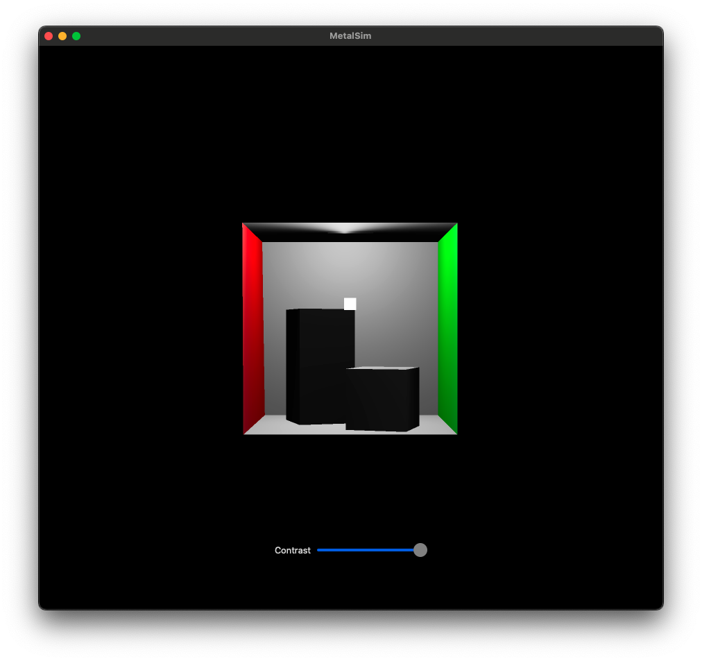

# Swift and Metal Project

This project demonstrates the use of Swift and Metal for rendering on macOS. It showcases a basic Metal setup with a simple rendering loop.



## Requirements

- macOS 10.15+ (Catalina or later)
- Xcode 12.0 or higher
- Metal-capable macOS device

## Installation

1. Clone the repository:
   ```bash
   git clone https://github.com/GabrielBernardoDaSilva/MetalSim
